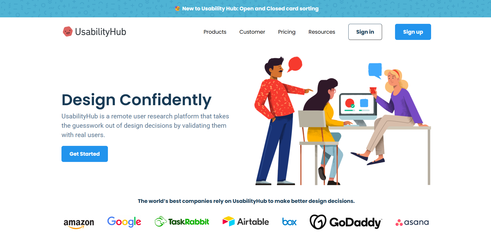

# Usability Hub



## Overview

Welcome to Usability Hub! This website is designed using HTML and CSS to provide a seamless and user-friendly experience. My goal is to create an intuitive interface that enhances usability and accessibility for all users.

## Features

- **Responsive Design**: The website is fully responsive and works on all devices.
- **Clean Layout**: A clean and modern layout to ensure easy navigation.
- **Accessibility**: Designed with accessibility in mind to cater to all users.

## Technologies Used

- **HTML**: For the structure of the website.
- **CSS**: For styling and layout.

## Getting Started

To get a local copy up and running, follow these simple steps:

1. Clone the repository:
    ```sh
    git clone https://github.com/nilavtalukdar06/usability-hub.git
    ```
2. Navigate to the project directory:
    ```sh
    cd usability-hub
    ```
3. Install dependencies:
    ```sh
    # If you are using npm
    npm install

    # If you are using bun
    bun install
    ```
4. Run the development server:
    ```sh
    # If you are using npm
    npm run dev

    # If you are using bun
    bun run dev
    ```

## Contributing

Contributions are what make the open-source community such an amazing place to learn, inspire, and create. Any contributions you make are **greatly appreciated**.

1. Fork the Project
2. Create your Feature Branch (`git checkout -b feature/AmazingFeature`)
3. Commit your Changes (`git commit -m 'Add some AmazingFeature'`)
4. Push to the Branch (`git push origin feature/AmazingFeature`)
5. Open a Pull Request

## Contact

Your Name - [nilavtaukdar06@gmail.com](mailto:nilavtalukdar06@gmail.com)

Project Link: [https://github.com/nilavtalukdar06/usability-hub.git](https://github.com/nilavtalukdar06/usability-hub.git)
